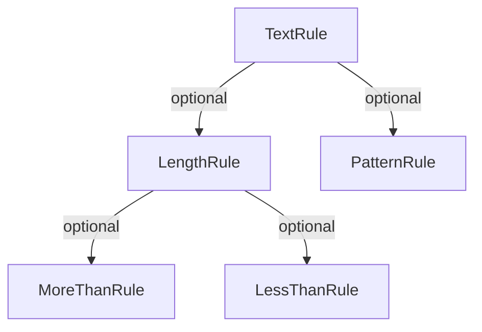
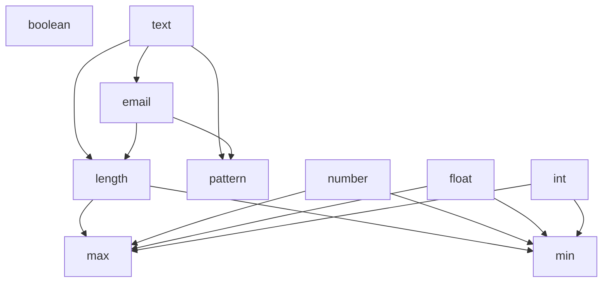

# Validator

A package for validation of misc values.

Observe that this is a pre-release, changes could be made to the base API before the first real release that breaks
any implementation done.  
If using the validation package before version 1.0.0, be sure to se the constraints on minor version, for example:

`"jitesoft/validator": "0.1.*"`

## Usage

Install package:
```text
$> composer require jitesoft/validator
```

When creating a validator, the available rules need to be set in the constructor. That way the validator knows which
rules it can use and can create them when needed.

```php
$validator = new Validator(
  Email::class,
  Text::class
);
```

There are multiple ways to validate data, the following snippets are all valid:

Single validation with single rule:

```php
$validator->validate('text', 'abc123');
```

Single validation with deep rules:

```php
$validator->validate(['text' => ['pattern' => '/?.*/' ], 'abc123');
```

Multiple rules and values in indexed arrays:

```php
$validator->validate([
    'text',
    'number'
], [
    'abc',
    123
]);
```

Multiple deep rules with indexed array of values:

```php
$validator->validate([
    'text' => [
        'pattern' => '/?.*/'
    ],
    'number' => [
        'max' => 200
    ]
], [
    'abc',
    123
]);
```

Named tests with named values:

```php
$validator->validate([
    'first' => [ 
        'text' => [ 
            'pattern' => '/?.*/' 
        ]
    ],
    'second' => 'number'
], [
  'second' => 123,
  'first' => 'abc123'
]);
```

Named test on indexed array.

```php
$validator->validate([
    'first' => [ 
        'text' => [ 
            'pattern' => '/?.*/' 
        ]
    ],
    'second' => 'number'
], [ 'abc', 123 ]);
```

The returned value is a boolean which is true if the data is valid or false if it is not.  
If false, the `$validator->getErrors()` method will return the errors of the validation tests.

By default, the validator will not throw any exceptions. But if this is wanted, set the `$throw` argument of the
validator constructor to true, and it will throw `ValidationException` instead of returning false.

## The idea

The idea of the validation structure is that each validation rule can have a set of sub-rules.
The sub-rule in turn can have other sub-rule.  
When implementing rules it's important to make sure that the validators don't create a never ending loop of self
references.



```php
$validator->validate([
  'Test' => [
    'text' => [
      'length' => [
        'max' => 5,
        'min' => 2
      ],
      'pattern' => '/abc(\d{3})/s'
    ]
], 'abc123');
```

When a validator errors out, it should fetch the error from the given rules and depending on the `throw` param either
just store it in a error or throw a validation exception.

## Currently implemented rules

Following is a graph of implemented rules and their sub-rule relations.
Rule names are the actual names, not class names. Check the `src/Rules` directory for class names.



## Changes

### 0.1.0

#### Validation calls

Updated validation function call. It now takes rules as first argument and values as second.  
The rules can either be a single string to test a single value, an array of strings testing an array of values or
an associative array with Test names which defines rules and tests either a list of values or a matching assoc array of values.


#### Errors

The errors are now associative arrays which have the 'test name' as a key then each rules and their errors as a key-value pair
under each test name.  
The rules and errors are flattened, so the depth is always the same:

```php
$errors = [
  'TestName1' => [
    'text' => 'some error'
  ],
  'TestName2' => [
    'min' => 'Some error',
    'max' => 'Some error',
    'pattern' => 'Some other error.'
  ]
]
```

Input is wanted on the flattened array. Should it be flattened or should it have a new depth for each rule name?


## License

MIT.
