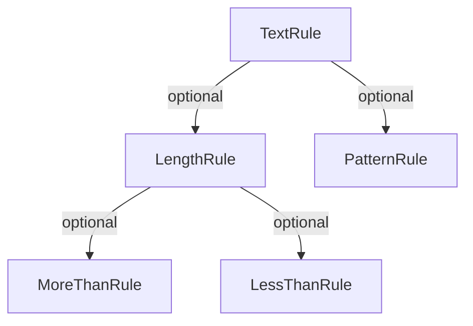

# Validator

A package for validation of misc values.  
  
## The idea

The idea of the validation structure is that each validation rule can have a set of sub-rules.
The sub-rule in turn can have other sub-rule.  
When implementing rules it's important to make sure that the validators don't create a never ending loop of self 
references.  



In the above example structure, the `TextRule` have two sub rules, the `LengthRule` and the `PatternRule`.  
Both are optional and the `LengthRule` have optional `MoreThan` and `LessThan` rules.  
When running the validation, the call could be made with either just a check that the value is a text:

```php
$validator->validate('abc123', [ 'text' ]);
```

Or with the use of the sub-rules.

```php
$validator->validate('abc123', [
  'text' => [
    'length' => [
        'lessthan' => 5,
        'morethan' => 2
    ],
    'pattern' => '/abc(\d{3})/s'
  ]
]);
```

When a validator errors out, it should fetch the error from the given rules and depending on the `throw` param either
just store it in a error or throw a validation exception.

